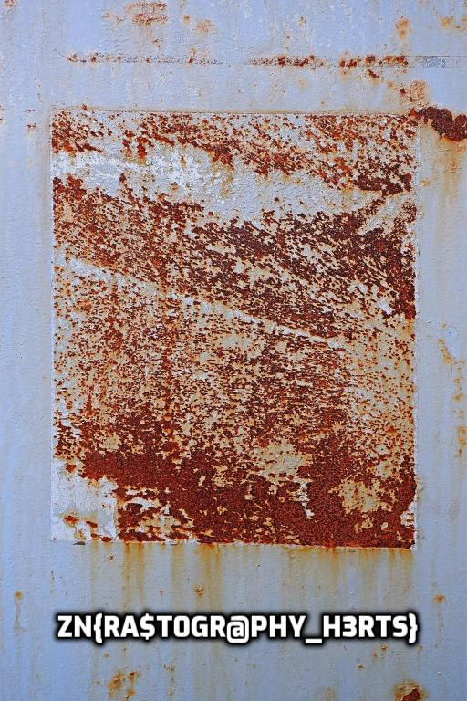

# Unlock

```
Oh, we found a strange files on the Internet, feel free to find what's inside.
```

## Challenge analysis

After extracting the archice we get two files:
- `locker`: a Linux x86-64 executable.
- `secret.png.enc`: an encrypted `PNG` file.

Here we can guess that we will need to reverse `locker` in order to decrypt `secret.png.enc`.

Reversing `locker` is an easily task, the only difficulty is that the binary is written in `Rust` but there is no need to understand this langage to understand how this executable work. Moreover, everything is implemented in the one function named `project::main::hd7e10029f20f35a8`. 

```c
#define ROR32(v, n) (((uint32_t)(v)) >> n) | (((uint32_t)(v)) << (32 - n))
#define ROR64(v, n) ((((uint64_t)(v)) >> n) | (((uint64_t)(v)) << (64 - n)))

unsigned int encrypt_dword(unsigned long val, unsigned long long k_round) {
    long j;
    unsigned char shift_v;
    unsigned char rigth_v, left_v;

    j = 0x4D;
    while (j > 0) {

        shift_v = ((val >> 0x04) & 0x01) |
                  ((val >> 0x1A) & 0xE0) |
                  ((val >> 0x16) & 0x10) |
                  ((val >> 0x0D) & 0x08) |
                  ((val >> 0x07) & 0x04) |
                  ((val >> 0x04) & 0x02);

        rigth_v = BIT(val, 0x00) ^ BIT(val, 0x0C) ^ BIT(val, 0x14) ^ BIT(k_round, 0x00);
        left_v  = BIT(0xBB880F0FC30F0000, shift_v);

        if (rigth_v == left_v)
            val = ROR32(val & 0xFFFFFFFE, 0x01);
        else
            val = ROR32(val | 0x01, 0x01);

        k_round = ROR64(k_round, 0x01);

        j--;
    }

    return val;
}
```

The algorithme is pretty simple to invert. To find the key we use the fact that the encrypted file is a `PNG` and should have a known header. To solve the final equation, I wrote the encrypt function using the `z3` syntax:
```python
def encrypt_val(val, k_round):
    """Encrypt function using Z3 operators and values"""

    # Logical operators written using the Z3 syntax
    rol_32 = lambda x, y: (x << y) | (LShR(x, 32 - y))
    rol_64 = lambda x, y: (x << y) | (LShR(x, 64 - y))
    ror_32 = lambda x, y: (LShR(x, y)) | (x << (32 - y))
    ror_64 = lambda x, y: (LShR(x, y)) | (x << (64 - y))
    bit_z  = lambda v, n: Extract(0, 0, LShR(v, n)) & BitVecVal(1, 1)

    j = 0x4D
    while j > 0:
        v32 = LShR(val, 4) & 1 | LShR(val, 26) & 0xE0 | LShR(val, 22) & 0x10 | LShR(val, 13) & 8 | LShR(val, 7) & 4 | LShR(val, 4) & 2

        rigth_val = bit_z(val, 0) ^ bit_z(val, 12) ^ bit_z(val, 20) ^ bit_z(k_round, 0)
        v33 = ZeroExt(32, v32)
        left_val  = bit_z(BitVecVal(0xBB880F0FC30F0000, 64), v33)

        val = If(rigth_val == left_val,
                ror_32(val & BitVecVal(0xFFFFFFFE, 32), BitVecVal(1, 32)),
                ror_32(val | BitVecVal(1, 32), BitVecVal(1, 32))
                )

        k_round = ror_64(k_round, 1)

        j -= 1

    return val
```

The complete script can be found [here](./locker.png). Finally, the flag can be found on this image:
